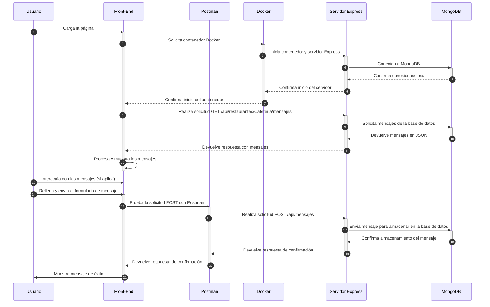

```mermaid
sequenceDiagram
    autonumber
    participant U as Usuario
    participant F as Front-End
    participant PM as Postman
    participant D as Docker
    participant S as Servidor Express
    participant DB as MongoDB

    U->>F: Carga la página
    activate F
    F->>D: Solicita contenedor Docker
    activate D
    D->>S: Inicia contenedor y servidor Express
    activate S
    S->>DB: Conexión a MongoDB
    activate DB
    DB-->>S: Confirma conexión exitosa
    deactivate DB
    S-->>D: Confirma inicio del servidor
    deactivate S
    D-->>F: Confirma inicio del contenedor
    deactivate D
    F->>S: Realiza solicitud GET /api/restaurantes/Cafeteria/mensajes
    activate S
    S->>DB: Solicita mensajes de la base de datos
    activate DB
    DB-->>S: Devuelve mensajes en JSON
    deactivate DB
    S-->>F: Devuelve respuesta con mensajes
    deactivate S
    F->>F: Procesa y muestra los mensajes
    deactivate F
    U->>F: Interactúa con los mensajes (si aplica)

    U->>F: Rellena y envía el formulario de mensaje
    activate F
    F->>PM: Prueba la solicitud POST con Postman
    activate PM
    PM->>S: Realiza solicitud POST /api/mensajes
    activate S
    S->>DB: Envía mensaje para almacenar en la base de datos
    activate DB
    DB-->>S: Confirma almacenamiento del mensaje
    deactivate DB
    S-->>PM: Devuelve respuesta de confirmación
    deactivate S
    PM-->>F: Devuelve respuesta de confirmación
    deactivate PM
    F->>U: Muestra mensaje de éxito
    deactivate F
```
